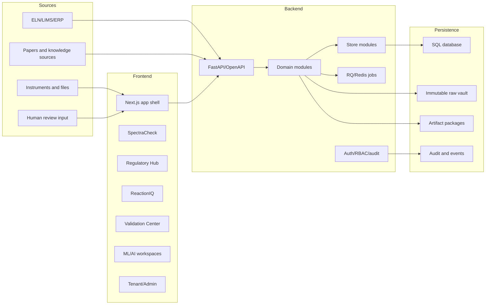
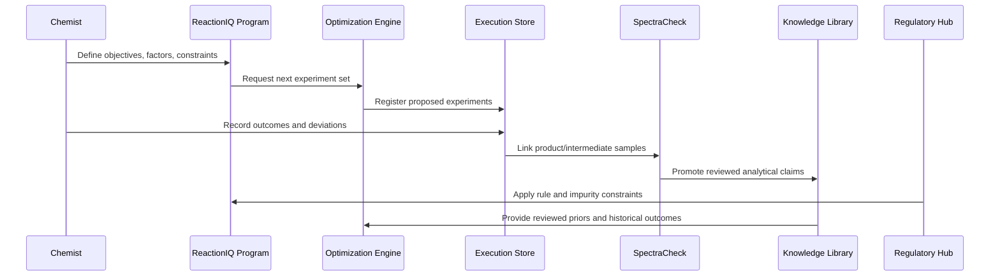

# MolTrace Technical White Paper

**Version:** Draft 1.0  
**Date:** May 17, 2026  
**Audience:** engineering leads, scientific informatics architects, platform evaluators, validation engineers, security reviewers, and technical diligence teams.

**Living document rule:** Every important MolTrace development must be reflected in this technical white paper going forward. Material updates include new APIs, schemas, evidence contracts, store modules, migrations, product renames, module-order changes, security or tenant-boundary controls, deployment architecture, validation evidence, AI/ML governance changes, and important new external standards or literature. Updates to this technical paper should be cross-checked against the companion hybrid white paper before release.

## Abstract

MolTrace is a modular scientific intelligence platform organized around **SpectraCheck > Regulatory Hub > ReactionIQ**, with supporting validation readiness, knowledge curation, ML governance, controlled AI inference, and enterprise tenant operations. This technical white paper describes the architecture implemented across `moltrace_backend`, `moltrace_frontend`, and `moltrace_docs`; the evidence and provenance contracts that connect the modules; the security and validation controls required for regulated scientific use; and the technical roadmap needed to move the ecosystem from broad prototype coverage to production-grade deployment.

The core architectural claim is that MolTrace should not be modeled as a single "AI chemistry app." It is better modeled as an evidence operating system. Scientific modules generate typed evidence. Governance modules validate, review, sign, version, and package that evidence. Enterprise modules isolate tenants, control access, normalize artifacts, and expose integration points. AI modules operate inside those boundaries rather than bypassing them.

## 1. Technical Thesis

Scientific software for regulated chemistry fails when it collapses four separate concerns into one untraceable action: data ingestion, analytical interpretation, model inference, and decision release. MolTrace intentionally separates those concerns.

The platform architecture is built around six technical invariants:

1. Raw scientific records are preserved separately from derived artifacts.
2. Every computational claim must expose provenance, input context, limitations, and review state.
3. Cross-module decisions must be assembled from versioned evidence objects, not copied text.
4. AI inference must be governed by model context, dataset lineage, evaluation evidence, thresholds, fallback rules, and human review.
5. Tenant operations must isolate data, entitlements, security profiles, validation profiles, usage, ROI, and audit exports.
6. Production adoption requires validation evidence: tests, traceability, controlled records, inspection packages, and computer software assurance artifacts.

This thesis aligns with ICH analytical procedure lifecycle guidance, FDA and EMA AI governance direction, FDA computer software assurance guidance, Part 11 electronic record expectations, FAIR NMR data goals, mzML interoperability principles, and the current NMR/ML literature on automated but uncertainty-aware structure elucidation [1-15].

## 2. Reference Architecture

MolTrace uses a layered architecture with a frontend experience, an API/domain backend, persistence and artifact stores, background execution, and external connectors.



The backend is implemented in Python 3.11+ with FastAPI, Pydantic, SQLAlchemy, Alembic, RDKit, optional nmrglue/Numpy for raw FID work, Redis/RQ for queueable execution, and a test suite that covers both scientific modules and platform surfaces [20,22]. The frontend is a Next.js 16 and React 19 application using TypeScript, Radix primitives, Tailwind, React Query, Plotly, uPlot, Recharts, Three.js, generated OpenAPI types, Vitest, and Playwright [24,25].

The important architectural pattern is not the framework selection. It is the division of responsibility:

| Layer | Responsibility | Representative implementation |
| --- | --- | --- |
| Presentation | Module workspaces, scientific viewers, navigation, review workflows, controlled UI states | `moltrace_frontend/app`, `components/science`, `components/spectracheck`, `components/regulatory-hub`, `components/validation` |
| API contract | Request validation, auth dependency wiring, OpenAPI schema, response-model stability | `moltrace_backend/src/nmrcheck/api.py`, `nmr2d_routes.py`, generated frontend schema |
| Domain engines | Chemistry, spectra, NMR/MS/LC-MS evidence, Regulatory Hub evidence, ReactionIQ optimization, scoring | `analysis.py`, `proton.py`, `carbon13.py`, `candidate.py`, `hrms.py`, `msms.py`, `lcms_*`, `reaction_bo.py` |
| Stores | Durable application state and tenant/domain records | `*_store.py` modules, SQLAlchemy ORM |
| Evidence packages | Exportable reports, raw packages, manifests, processing metadata | `regulatory_report.py`, `export_raw_package.py`, `visualization.py`, artifact APIs |
| Governance | Auth, RBAC, audit, review, validation, model governance, tenant boundaries | `security.py`, `validation_center_store.py`, `ml_model_factory_store.py`, `tenant_saas_store.py` |

## 3. Evidence Object Model

MolTrace should standardize every scientific claim as a versioned evidence object. Several modules already implement this pattern using input provenance, SHA-256 hashes, warnings, limitations, human-review flags, and report metadata. The technical version of the contract can be expressed as:

```json
{
  "evidence_id": "uuid-or-database-id",
  "evidence_type": "nmr.predicted_match | ms.hrms | lcms.consensus | reactioniq.optimization | regulatory.rule | ai.inference",
  "schema_version": "moltrace.evidence.v1",
  "tenant_id": "tenant-key-or-id",
  "subject": {
    "sample_id": "sample-001",
    "compound_id": "optional-compound-id",
    "candidate_id": "optional-candidate-id",
    "program_id": "optional-program-id"
  },
  "inputs": [
    {
      "name": "observed_proton_text",
      "source": "form | upload | connector | derived_artifact",
      "sha256": "64-character-hash",
      "size_bytes": 1234,
      "content_type": "text/plain"
    }
  ],
  "method_context": {
    "method_id": 12,
    "model_version_id": 4,
    "scoring_profile_id": 7,
    "threshold_profile_id": 3,
    "processing_recipe": {}
  },
  "outputs": {
    "score": 0.82,
    "label": "best_supported",
    "rank": 1,
    "features": [],
    "matched_evidence": [],
    "unmatched_evidence": []
  },
  "quality": {
    "warnings": [],
    "limitations": [],
    "contradictions": [],
    "missing_layers": [],
    "confidence_explanation": []
  },
  "review": {
    "human_review_required": true,
    "human_review_status": "pending_review",
    "reviewer_id": null,
    "reviewed_at": null
  },
  "lineage": {
    "parent_evidence_ids": [],
    "artifact_ids": [],
    "raw_archive_ids": [],
    "created_at": "ISO-8601"
  }
}
```

This contract should be the connective tissue between SpectraCheck, Regulatory Hub reports, ReactionIQ, validation packages, and AI governance. It keeps MolTrace from becoming a set of disconnected modules that happen to share a UI.

## 4. SpectraCheck Technical Pipeline

SpectraCheck is the primary evidence producer. It accepts text, processed spectra, raw FID archives, processed 2D peak tables, HRMS/MS peak lists, mzML/mzXML-derived peak views, LC-MS feature tables, and candidate structures.

### 4.1 NMR Ingestion and Validation

The current baseline supports:

- Rule-based 1H NMR validation against SMILES.
- Solvent-aware 1H evidence scoring.
- 13C NMR beta validation and carbon count/region checks.
- DEPT/APT-like carbon typing.
- Processed spectrum preview for CSV, TSV, and simple JCAMP-DX exports.
- Feature-flagged processed 2D NMR support for COSY, HSQC/HMQC, and HMBC.
- Raw Bruker and Varian/Agilent 1D FID beta processing through optional FID dependencies.

From an implementation perspective, the NMR stack is divided into parser, chemistry, evidence, visualization, and storage modules. That separation is technically important. Parsers produce structured observations. Chemistry code derives expected constraints from SMILES. Evidence engines compare observations with expectations. Viewers render traces and peaks. Stores persist run metadata and reports.

The strongest invariant is raw FID immutability. Raw FID uploads are stored as vault records with SHA-256 hashes, vendor metadata, required-file status, and safe-path inspection. Processing produces derivative metadata and run records. The raw archive is not overwritten by phase correction, baseline correction, peak picking, or display gain. This preserves chain of custody and supports data-integrity review [7,19].

### 4.2 Candidate Ranking and Predicted NMR

Candidate comparison, spectral similarity, and predicted NMR matching are separate scoring layers. The backend contract for `POST /prediction/nmr/match/evidence` explicitly states that candidate-specific predicted NMR matching ranks candidates against observed 1H, 13C, and optional HSQC/HMQC-style evidence. It returns `best_candidate`, `ranked_candidates`, `evidence_layers_used`, `input_provenance`, warnings, limitations, and human-review status [26].

This matches the scientific pattern in automated structure elucidation literature. DP4-AI, DP5q, multitask NMR structure search, and CASE systems all reduce interpretation burden, but they do so with assumptions about candidate sets, data quality, model calibration, and ambiguous peaks [10-14]. MolTrace should preserve the distinction between:

- **Candidate plausibility:** Evidence supports one candidate more than another.
- **Candidate contradiction:** One or more evidence layers conflict with the candidate.
- **Identity decision:** A human-reviewed release claim based on sufficient orthogonal evidence.

### 4.3 Mass Spectrometry and LC-MS Evidence

The MS/LC-MS path is modular:

1. HRMS exact mass constrains formula and candidate plausibility.
2. Adduct and isotope inference proposes charge, isotope clusters, M+1/M+2 patterns, carbon-count hints, halogen signatures, and adduct pairs.
3. Processed MS/MS annotation adds precursor consistency, neutral losses, fragment hypotheses, explained peak count, and explained intensity.
4. Fragmentation-tree reasoning links precursor, fragment, and subfragment peaks through diagnostic neutral losses.
5. LC-MS import bridge preserves mzML/mzXML or processed peak-list provenance and produces downstream MS1/MS/MS peak views.
6. LC-MS feature detection extracts EIC/XIC traces, detects target features, estimates peak purity, flags coelution, and links nearby MS/MS scans.
7. Feature grouping aligns retention time, subtracts blanks, groups sample/QC/reference features, and produces family hints.
8. LC-MS consensus scores feature families using blank-subtraction gates, isotope-envelope agreement, adduct-pair consistency, in-source-loss relationships, and MS/MS precursor linkage.
9. The LC-MS consensus bridge connects promoted feature families to unified candidate confidence.

This decomposition is correct for production because each layer has different input assumptions and failure modes. mzML import errors should not become fragmentation-tree errors. A peak-purity warning should not silently suppress HRMS evidence. A blank-like feature should become a reviewable contradiction or limitation, not a hidden filter.

## 5. Unified Confidence and Regulatory Report Composition

The unified confidence engine should be treated as a reducer over evidence objects, not as a black-box classifier. Its job is to aggregate layer-level support and contradiction signals into candidate-level decision support.

The report composer then turns a unified confidence result, or a request passed through the unified confidence engine, into an audit-ready structure elucidation record. The implemented Week 34 design includes report metadata, provenance hashes, source files, processing history, candidate tables, contradictions, missing evidence, and a human-review release gate [27].

The technical boundary is:

- Evidence modules produce scored observations.
- Unified confidence aggregates support, missingness, and contradictions.
- Report composer packages an auditable narrative and machine-readable payload.
- Review workflow releases or rejects the report.

That boundary prevents report generation from becoming the place where scientific conclusions are silently invented.

## 6. Regulatory Hub, Validation, and Quality Architecture

Regulatory Hub is the second primary product surface after SpectraCheck. It governs the evidence that SpectraCheck produces and provides the regulatory and quality frame that ReactionIQ uses when planning and evaluating experiments. Regulatory Hub, Regulatory Surveillance, Regulatory Compliance, Validation Center, Quality Control, Method Registry, and Operations/Security modules should be treated as the platform control plane.

Relevant implemented areas include:

- Regulatory source library, surveillance dashboard, rule updates, source-version timeline, notifications, action queue, and dossiers.
- Compliance engine records, impurity thresholds, batch regulatory assessment panels, and CTD Module 3 bundle cards.
- Validation projects, controlled records, traceability, data integrity, electronic signatures, deviations, CAPA, releases, and inspection package surfaces.
- Method registry validation, scoring profiles, threshold profiles, and method/model references in jobs and evidence records.
- System health, deployment diagnostics, storage summaries, queue status, release health, and admin security/debug surfaces.

The control-plane data model should answer seven validation questions:

1. What method, model, scoring profile, and threshold profile produced this result?
2. What raw or source records were used, and can their hashes be verified?
3. What transformations were applied?
4. What warnings, limitations, and contradictions were known at the time?
5. Who reviewed the evidence, and under what role/permission?
6. What release decision was made?
7. Can the system reproduce or export the evidence package?

ICH Q2(R2), ICH Q14, Part 11, data integrity guidance, FDA CSA, FDA AI guidance, and EMA AI guidance all point toward this kind of lifecycle record [1-7].

## 7. ReactionIQ Architecture

ReactionIQ is the third primary product surface in the sequence. It extends the evidence model from analytical and regulatory data to experimental decisions. Current source and tests show reaction advisory, Bayesian optimization, execution planning, reaction storage, regulatory constraints, compound linking, response previews, and model diagnostics [28].

Technically, the ReactionIQ loop should be modeled as:



This creates two feedback loops. The fast loop optimizes reaction outcomes. The slow loop improves organizational knowledge and model quality. The slow loop is where MolTrace can differentiate: ReactionIQ can connect reaction outcomes to confirmed structures, impurity evidence, method performance, Regulatory Hub constraints, and ML-ready datasets.

## 8. Knowledge, ML, and Controlled AI Plane

MolTrace has a clear governance plane for AI and ML:

- `knowledge_flywheel_store.py` manages knowledge sources, extractions, records, review, dataset candidates, benchmark candidates, and model-improvement signals.
- `ml_model_factory_store.py` manages ML tasks, dataset versions, training runs, evaluation runs, artifacts, model cards, deployment candidates, calibration, and OOD assessment.
- `ai_inference_store.py` and `ai_evidence_store.py` manage controlled prediction services, inference metadata, AI evidence review, and review queues.

The technical architecture should enforce four separations:

1. **Knowledge extraction vs approved knowledge:** Extracted claims are candidates until reviewed.
2. **Training data vs benchmark data:** Leakage risk and split recommendation must be tracked before model use.
3. **Model artifact vs deployment candidate:** A trained artifact is not a released service.
4. **AI output vs released decision:** Inference output is evidence and requires context-specific review when used in quality, regulatory, or release workflows.

This is the practical implementation of context-of-use model governance. A controlled AI inference record should include:

- Service key and version.
- Model artifact and model-card link.
- Input hashes and tenant context.
- Threshold profile and calibration state.
- OOD and fallback evaluation.
- Human-review rules.
- Output confidence and explanation.
- Downstream evidence IDs.

## 9. Tenant SaaS, Security, and Access Boundaries

MolTrace has backend and frontend surfaces for tenant administration, tenant environments, entitlements, module access, tenant data boundaries, security profiles, validation profiles, usage summaries, ROI snapshots, audit exports, mobile tenant summary, go-live readiness, onboarding projects, pilot programs, procurement packages, and demo tenant seeds [29].

The technical SaaS boundary should include:

- Tenant-scoped records for scientific evidence, artifacts, reports, jobs, models, sources, users, and connectors.
- Entitlement-based module access for SpectraCheck, Regulatory Hub, ReactionIQ, Validation Center, Knowledge Library, ML/AI, Settings, and Admin.
- Environment separation for dev, sandbox, validation, production, and demo.
- Data-boundary profiles for isolation mode, retention, export policy, and allowed connectors.
- Security profiles for SSO/MFA expectations, session policy, audit export policy, and role policy.
- Validation profiles for release gates, controlled records, inspection readiness, and electronic-signature rules.

Authentication and authorization currently include registration, login, verification, password reset, admin promotion via `ADMIN_EMAILS`, auth/me, logout, token actions, and protected dependencies. The next technical hardening step is to make tenant context impossible to skip in production routes and to add automated tests that assert cross-tenant denial for each high-risk record family.

## 10. Interoperability and Artifact Normalization

The interoperability layer is where MolTrace becomes deployable in a real lab. Current implementation signals include connector keys, credentials, normalized artifacts, webhook target hashing, CTD package artifacts, file normalization, and source metadata [30].

The normalized artifact pattern should become a platform primitive:

```json
{
  "artifact_id": "artifact-123",
  "schema_version": "moltrace.normalized_artifact.v1",
  "source": {
    "connector_key": "instrument-folder-01",
    "source_filename": "sample_123.mzML",
    "source_sha256": "hash",
    "received_at": "ISO-8601"
  },
  "normalization": {
    "normalizer_version": "phase62.v1",
    "content_type": "application/mzml",
    "warnings": [],
    "derived_files": []
  },
  "links": {
    "tenant_id": "tenant-a",
    "sample_id": "sample-123",
    "evidence_ids": []
  }
}
```

This pattern gives every downstream module a consistent way to consume files without taking ownership of raw connector complexity.

## 11. Frontend Technical Architecture

The frontend is not merely a shell around API forms. It encodes product structure:

- App routes map to platform modules.
- `AppShell`, topbar, sidebar, mobile navigation, tenant selector, backend status indicator, and AI evidence queue provide cross-cutting context.
- Science viewers handle domain-specific rendering: SpectrumViewer, SpectrumViewer1D, Nmr2DViewer, ChromatogramViewer, FragmentTreeViewer, MsmsMirrorPlot, UPlotCanvas, evidence cards, and confidence rings.
- The design system provides module accent rules, dashboard sections, KPI cards, alert cards, module cards, tab styling, severity coding, and visual consistency.
- The generated OpenAPI schema and API client provide type-safe backend integration.

The recommended frontend contract is:

1. UI components never invent final claims.
2. UI components display backend evidence labels, limitations, warnings, contradictions, review state, and provenance fields.
3. Copy actions between modules should copy structured evidence or source hashes, not only display text.
4. Report previews should separate draft, locked, signed, and superseded states.
5. Tenant context and entitlement state should be visible in top-level chrome and enforced in API calls.

## 12. Persistence, Migrations, and Job Execution

The backend uses SQLAlchemy ORM, Alembic migrations, SQLite compatibility helpers for local development, and optional Redis/RQ queueing. Existing migrations show a platform arc:

- Week 8/24/25 baseline, raw archive, and 2D NMR records.
- Phase 58 ML Model Factory.
- Phase 59 controlled AI inference.
- Phase 60 product orchestration.
- Phase 61 mobile PWA field review.
- Phase 62 interoperability.
- Phase 63 validation center.
- Phase 64 tenant SaaS.
- Phase 65 golden pilot and demo seeding.
- AI evidence review.

The local SQLite schema helper adds missing columns for development continuity, but production should rely on Alembic migrations as the authoritative schema evolution mechanism. Scientific evidence systems need explicit migration discipline because old reports must remain interpretable after schemas evolve.

Queueable jobs should be used for:

- Raw FID processing.
- Large mzML/mzXML import and feature extraction.
- Batch report/artifact generation.
- Knowledge extraction runs.
- ML training/evaluation jobs.
- Validation package generation.
- Bulk audit exports.

Each queued job should record input hashes, tenant context, method/model versions, job status, retry policy, worker version, and output artifact IDs.

## 13. Testing and Validation Evidence

The test suite is already broad. It includes scientific regression tests, week-specific feature tests, API tests, UI contract tests, security hardening tests, tenant SaaS tests, validation center tests, mobile PWA tests, interoperability tests, and end-to-end smoke coverage.

For regulated adoption, tests should be organized into validation evidence categories:

| Category | Purpose | Existing signals |
| --- | --- | --- |
| Scientific correctness | Known examples and regression fixtures for chemistry/spectra behavior | `test_week21_scientific_regression.py`, NMR fixtures, HRMS/MS/LC-MS week tests |
| Contract stability | Ensure API response fields and OpenAPI schemas remain compatible | prediction API tests, frontend contract API tests, response stability tests |
| Data integrity | Verify hashes, raw vault immutability, archive export, processing metadata | raw vault and FID tests |
| Security and tenant isolation | Auth, RBAC, admin controls, cross-tenant behavior, security events | auth, collaboration RBAC, tenant SaaS, security hardening tests |
| Validation readiness | Controlled records, traceability, inspection packages, release records | Phase 63 validation center tests |
| Operational readiness | Health, queue status, deployment settings, storage/jobs summaries | health, deployment, release-health tests |

The next step is to create a traceability matrix mapping requirements to tests, APIs, modules, and validation evidence. This matrix should be generated or checked in CI so gaps are visible before release.

## 14. Deployment and Operational Model

The backend deployment checklist currently identifies required environment variables such as `APP_ENV`, `DEBUG`, `DATABASE_URL`, `BASE_URL`, `HEALTHCHECK_PATH`, `ADMIN_EMAILS`, and `API_KEY`, plus recommended `ALLOWED_ORIGINS`, `REDIS_URL`, and `QUEUE_NAME` [31]. Production deployments should also define:

- Raw vault storage backend and retention policy.
- Artifact storage backend and encryption policy.
- Database backup and point-in-time restore policy.
- Redis worker scaling and failure policy.
- Connector credential vaulting policy.
- Audit export retention and access policy.
- Tenant environment promotion policy.
- Secrets rotation and incident response policy.

The frontend uses a backend proxy pattern: browser code calls `/api/backend/*`, and the Next.js server forwards to `API_BASE_URL`. This avoids hard-coded `localhost` calls and supports customer-hosted deployments [25].

## 15. Known Technical Risks

The primary technical risks are manageable but should be explicit:

- **Schema sprawl:** The platform has many modules and record families. Versioned evidence and normalized artifact schemas are needed to reduce long-term entropy.
- **Route centralization:** A very large `api.py` can become difficult to govern. Router decomposition by domain would improve maintainability and OpenAPI ownership.
- **Scientific calibration:** Heuristic and beta scoring layers need calibration datasets, acceptance criteria, and explicit uncertainty language.
- **Raw data scale:** mzML, raw FID, artifact packages, and image/render outputs require storage policies and streaming-safe APIs.
- **Tenant enforcement:** Tenant context must be mandatory for production data paths, with tests for every high-risk object family.
- **AI credibility:** Controlled inference needs context-of-use records, model cards, calibration/OOD checks, deployment approvals, and monitoring before customer reliance.
- **Validation packaging:** Tests exist, but formal validation packages need traceability, risk ranking, expected results, execution evidence, and approval workflows.

## 16. Technical Roadmap

The recommended engineering roadmap is:

1. **Versioned evidence schema:** Create shared Pydantic models for evidence, provenance, review, quality, method context, and lineage.
2. **Domain router split:** Move large API sections into routers for SpectraCheck, Regulatory Hub, ReactionIQ, validation, knowledge, ML/AI, tenants, files/artifacts, and admin.
3. **Tenant guard library:** Build a reusable access-context dependency and policy checker with cross-tenant denial tests.
4. **Artifact registry:** Standardize normalized artifacts, source files, derived files, manifests, and export packages.
5. **Method/model registry integration:** Require method, scoring, threshold, and model version references on all high-impact evidence.
6. **Validation matrix generator:** Link requirements, tests, code paths, API routes, and evidence packages.
7. **AI credibility package generator:** Produce context-of-use, dataset lineage, evaluation, calibration, OOD, fallback, and review-policy packages per AI service.
8. **Connector SDK:** Formalize watch-folder, instrument, ELN/LIMS, and webhook connector contracts with hash preservation and credential isolation.
9. **Report lock and e-signature workflow:** Harden draft, locked, signed, superseded, and amended report states.
10. **Observability:** Add structured logs, event names, metrics, and audit trails for high-impact routes and background jobs.

## Conclusion

The technical architecture of MolTrace is already pointed in the right direction: preserve raw evidence, generate typed scientific claims, expose uncertainty, govern model inference, isolate tenants, and package decisions for review. The next engineering challenge is not inventing more modules. It is standardizing the evidence contract that makes the existing modules cohere.

If MolTrace hardens its evidence schema, tenant guardrails, artifact registry, method/model references, validation matrix, and AI credibility packages, it can become a technically defensible platform for regulated scientific intelligence. The product's strongest architectural choice is its restraint: automation proposes, scores, links, and packages evidence, while governed human review remains the release boundary.

## References

1. International Council for Harmonisation. **ICH Q2(R2): Validation of Analytical Procedures.** Final version, adopted November 1, 2023. https://database.ich.org/sites/default/files/ICH_Q2%28R2%29_Guideline_2023_1130.pdf
2. International Council for Harmonisation. **ICH Q14: Analytical Procedure Development.** Final version, adopted November 1, 2023. https://database.ich.org/sites/default/files/ICH_Q14_Guideline_2023_1116.pdf
3. U.S. Food and Drug Administration. **Considerations for the Use of Artificial Intelligence to Support Regulatory Decision-Making for Drug and Biological Products.** Draft guidance announcement, January 6, 2025. https://www.fda.gov/news-events/press-announcements/fda-proposes-framework-advance-credibility-ai-models-used-drug-and-biological-product-submissions
4. European Medicines Agency. **Reflection paper on the use of Artificial Intelligence (AI) in the medicinal product lifecycle.** EMA/CHMP/CVMP/83833/2023, first published September 30, 2024. https://www.ema.europa.eu/en/use-artificial-intelligence-ai-medicinal-product-lifecycle-scientific-guideline
5. U.S. Food and Drug Administration. **Computer Software Assurance for Production and Quality Management System Software.** Final guidance revision, February 2026. https://www.fda.gov/regulatory-information/search-fda-guidance-documents/computer-software-assurance-production-and-quality-management-system-software
6. U.S. Food and Drug Administration. **Part 11, Electronic Records; Electronic Signatures - Scope and Application.** https://www.fda.gov/regulatory-information/search-fda-guidance-documents/part-11-electronic-records-electronic-signatures-scope-and-application
7. U.S. Food and Drug Administration. **Data Integrity and Compliance With Drug CGMP: Questions and Answers.** Final guidance, December 2018. https://www.fda.gov/regulatory-information/search-fda-guidance-documents/data-integrity-and-compliance-drug-cgmp-questions-and-answers
8. nmrXiv. **Overview: FAIR and Open NMR data repository and computational platform.** https://docs.nmrxiv.org/introduction/intro.html
9. Martens, L. et al. **mzML - a Community Standard for Mass Spectrometry Data.** Molecular & Cellular Proteomics, 2011. PubMed: https://pubmed.ncbi.nlm.nih.gov/21063948/
10. Huang, Z.; Chen, M. S.; Woroch, C. P.; Markland, T. E.; Kanan, M. W. **A framework for automated structure elucidation from routine NMR spectra.** Chemical Science, 2021, 12, 15329-15338. https://doi.org/10.1039/D1SC04105C
11. Hu, F.; Chen, M. S.; Rotskoff, G. M.; Kanan, M. W.; Markland, T. E. **Accurate and efficient structure elucidation from routine one-dimensional NMR spectra using multitask machine learning.** ACS Central Science, 2024; arXiv:2408.08284. https://arxiv.org/abs/2408.08284
12. Howarth, A.; Ermanis, K.; Goodman, J. M. **DP4-AI automated NMR data analysis: straight from spectrometer to structure.** Chemical Science, 2020, 11, 4351-4359. https://doi.org/10.1039/D0SC00442A
13. Kotlyarov, R.; Howarth, A.; Goodman, J. M. **DP5 without DFT: uncertainty-calibrated graph neural net accelerates structure confirmation via NMR.** Chemical Science, 2026. https://doi.org/10.1039/D5SC06988B
14. Wenk, M.; Nuzillard, J.-M.; Steinbeck, C. **Sherlock - A Free and Open-Source System for the Computer-Assisted Structure Elucidation of Organic Compounds from NMR Data.** Molecules, 2023, 28, 1448. https://doi.org/10.3390/molecules28031448
15. Bishop, A. C.; Mimun, K.; Tan, W.; Cole, T. R.; Wand, A. J. **Harmonizing Peak Matching Between Multidimensional NMR Spectra.** bioRxiv preprint, 2026. Local source: `/Users/ci/Papers/Spectroscopy/Papers/Harmonizing Peak Matching Between Multidimensional NMR Spectra .pdf`.
16. Desimpel, S.; Dorbec, M.; Van Geem, K. M.; Stevens, C. V. **Bayesian optimization for chemical reactions.** Chemical Society Reviews, 2026, 55, 2731-2775. https://doi.org/10.1039/D5CS00962F
17. Shields, B. J. et al. **Bayesian reaction optimization as a tool for chemical synthesis.** Nature, 2021, 590, 89-96. https://doi.org/10.1038/s41586-021-03213-y
18. MacKnight, R.; Regio, J. E.; Ethier, J. G.; Baldwin, L. A.; Gomes, G. **Pre-trained knowledge elevates large language models beyond traditional chemical reaction optimizers.** 2025/2026 preprint. Local source: `/Users/ci/Papers/Reaction Optimization/2509.00103v2.pdf`.
19. MolTrace backend. **Active backend README and Week 22-39 capability history.** `moltrace_backend/README.md`.
20. MolTrace backend. **Backend package and dependencies.** `moltrace_backend/pyproject.toml`.
21. MolTrace backend. **Database, ORM, settings, security, queueing, and API modules.** `moltrace_backend/src/nmrcheck/`.
22. MolTrace backend. **Test suite coverage.** `moltrace_backend/tests/`.
23. MolTrace backend. **Deployment hardening checklist.** `moltrace_backend/docs/deployment_hardening.md`.
24. MolTrace frontend. **Frontend package, route tree, and dependencies.** `moltrace_frontend/package.json`.
25. MolTrace frontend. **Frontend README and backend proxy contract.** `moltrace_frontend/README.md`.
26. MolTrace backend. **MolTrace SpectraCheck Backend Contract.** `moltrace_backend/docs/moltrace_spectracheck_backend_contract.md`.
27. MolTrace backend. **Week 34 Regulatory-ready Structure Elucidation Report Composer.** `moltrace_backend/docs/week34_regulatory_ready_structure_report_composer.md`.
28. MolTrace frontend/backend. **ReactionIQ modules and reaction optimization API tests.** `moltrace_frontend/components/reaction-optimization/`, `moltrace_backend/src/nmrcheck/reaction_bo.py`, `moltrace_backend/src/nmrcheck/reaction_execution.py`.
29. MolTrace backend. **Tenant SaaS implementation.** `moltrace_backend/src/nmrcheck/tenant_saas_store.py`, `moltrace_backend/tests/test_phase64_tenant_saas_api.py`.
30. MolTrace backend. **Interoperability implementation.** `moltrace_backend/src/nmrcheck/interoperability_store.py`, `moltrace_backend/tests/test_phase62_interoperability_api.py`.
31. MolTrace backend. **Deployment hardening and operational diagnostics.** `moltrace_backend/docs/deployment_hardening.md`, `moltrace_backend/tests/test_week20_deployment_settings.py`, `moltrace_backend/tests/test_week21_release_health.py`.
